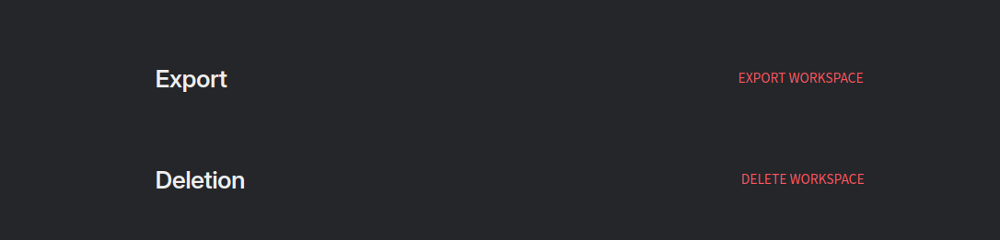
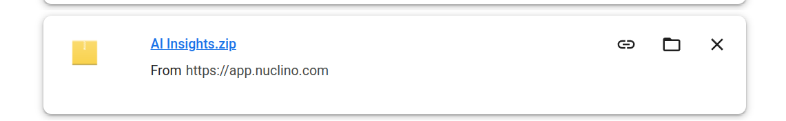
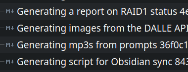
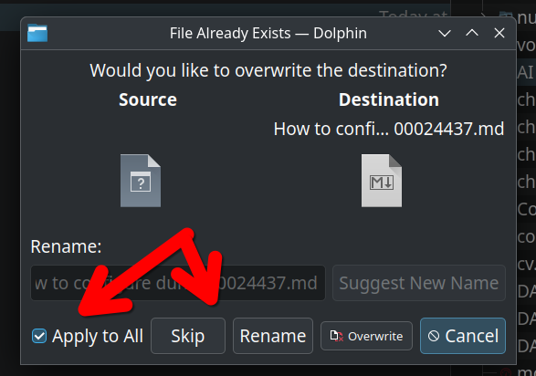

## Why backup SaaS data?

As a longtime dabbler in all manner of tech things, I've come to appreciate the huge value in keeping reliable backups of your data.

If you want my thoughts [at length](https://docs.bydanielrosehill.com/repos/blogs/thought-on-tech/backups/) about why I think that backing up *even* SaaS data is **really important**, click the preceding link (sorry, I'm being lazy today).

The TL;DR is that while I think that many SaaS tools are truly wonderful (PS: as a Linux user, I *try* to find SaaS-anything as it's a great way to work around cross-platform compatibility issues), I will never apologise for wanting to keep an independent copy of what I regard as important data. 

Nor will I ever fully trust a SaaS provider's insistence that *"we do backups, your data is safe."* It's my data and I don't want to forefeit ownership over it entirely just because your platform is truly great.

 

## The problem: SaaS doesn't give backup much love

Firstly, things aren't *all* that bleak.

There *are* SaaS providers (let's use Github as an example) that actually do a pretty great job at allowing users to have their cake and eat it too:

- You can use our great tech (which is probably way better than the self-hostable alternatives. Also, you don't need to host it!)  
- Here's an API that will allow you to do whatever you want with the data you're storing here.  

Thus, it's pretty easy, using Github, to do things like write Python scripts that will periodically duplicate your repositories onto, say, your NAS. 

To my mind, this should be the basic standard for shared data federacy in SaaS. Sadly it isn't. There are many tools I love but who only allow users to export their data as `zip` archives which invariably:

- Can't be used programatically  
- From a backup standpoint (if they can be considered backups at all) are very far from ideal. They're data-inefficient full backups which spit out the full user data *every single time* they run.   

With a bit of effort, though, you can implement a next-best-thing solution.

## V1 of my Zip archive approach

Here's an approach that I've developed using [Nuclino](https://www.nuclino.com) which offers excellent markdown handling.

The tool has a feature to export your workspace:

 

This gets you a `.zip`:



Inside of this are individual files:

 

 ## Script for incremental sync to cloud

 My approach is to (weekly):

 1) Pull down a zip export  
 2) Incrementally sync it to cloud storage (while keeping a local copy)  

## Copy (only) new files to local

This one is basic but easy. While I tried creating more elaborate scripts that would firstly extract the zip into a temporary folder and then compare with the files in the local and then incrementally sync those using `rsync`, ultimately the GUI (Dolphin) does this so well that there's simply no major advantage.

Just export the export archive into the folder where you're keeping a local copy of the backup, and select `skip` and `apply to all` to tell the GUI to skip the files that already exist.



You could script this part of the proccess too:

Let's say that I decide that I'll put the Zip exports in:

`/home/daniel/Cloud_Remotes/nuclino-zips`

And I'll keep a local copy of my notes in:

`/home/daniel/Cloud_Remotes/Nuclino_Backups`

I could add this script to my system at autostart it at boot:

```python
import os
import zipfile
from watchdog.observers import Observer
from watchdog.events import FileSystemEventHandler

# Define source and destination directories
SOURCE_DIR = "/home/daniel/Cloud_Remotes/nuclino-zips"
DEST_DIR = "/home/daniel/Cloud_Remotes/Nuclino_Backups"

class ZipFileHandler(FileSystemEventHandler):
    def on_created(self, event):
        # Check if the created file is a zip file
        if event.is_directory or not event.src_path.endswith(".zip"):
            return
        
        zip_path = event.src_path
        print(f"New zip file detected: {zip_path}")
        
        # Extract the zip file
        try:
            with zipfile.ZipFile(zip_path, 'r') as zip_ref:
                for file in zip_ref.namelist():
                    dest_file_path = os.path.join(DEST_DIR, file)
                    # Skip extraction if the file already exists
                    if os.path.exists(dest_file_path):
                        print(f"Skipping existing file: {dest_file_path}")
                        continue
                    
                    # Ensure destination directories exist
                    os.makedirs(os.path.dirname(dest_file_path), exist_ok=True)
                    
                    # Extract the file
                    print(f"Extracting: {file} to {dest_file_path}")
                    zip_ref.extract(file, DEST_DIR)
            
            print(f"Extraction completed for: {zip_path}")
        
        except Exception as e:
            print(f"Error processing {zip_path}: {e}")

if __name__ == "__main__":
    # Set up the observer to monitor the source directory
    event_handler = ZipFileHandler()
    observer = Observer()
    observer.schedule(event_handler, path=SOURCE_DIR, recursive=False)
    
    print(f"Monitoring directory: {SOURCE_DIR} for new zip files...")
    
    try:
        observer.start()
        while True:
            pass  # Keep the script running
    except KeyboardInterrupt:
        observer.stop()
    
    observer.join()
```    

## Copy new files, then sync those (incrementally) to B2

You could chain the first and following steps so that the system will:

1 - Watch for new zips  
2 - When new zips are detected, move in the new files (only), and then:  
3 - Trigger the GUI to sync those new files up to B2  

Which is as follows:

## GUI for incremental syncing to B2 remote

```bash

#!/bin/bash

# Define the source and destination paths
LOCAL="/home/daniel/backups/my-notes"
REMOTE="b2:mybucket"

# Function to check if local directory is empty
check_local_dir() {
    if [ -z "$(ls -A $LOCAL 2>/dev/null)" ]; then
        # Directory is empty or doesn't exist, use copy from remote
        echo "# Local directory is empty, downloading from B2..."
        return 0
    else
        # Directory has content, use sync
        echo "# Local directory has content, performing sync..."
        return 1
    fi
}

# Function to perform the operation
do_sync() {
    # Create a temporary file for logging
    LOGFILE=$(mktemp)
    
    # Launch terminal window for verbose output
    xterm -geometry 100x30 -T "Transfer Progress - Detailed Log" -e "tail -f $LOGFILE" &
    XTERM_PID=$!

    {
        if check_local_dir; then
            # Copy from remote if local is empty
            rclone copy -vv --progress --stats 1s --stats-one-line \
                --verbose --transfers 4 --checkers 8 \
                "$REMOTE" "$LOCAL" 2>&1 | tee -a "$LOGFILE"
        else
            # Sync if local has content
            rclone sync -vv --progress --stats 1s --stats-one-line \
                --verbose --transfers 4 --checkers 8 \
                "$LOCAL" "$REMOTE" 2>&1 | tee -a "$LOGFILE"
        fi | \
        while IFS= read -r line; do
            # Extract progress percentage for the progress bar
            if [[ $line =~ ([0-9]+)% ]]; then
                echo "${BASH_REMATCH[1]}"
            fi
            # Send current operation to dialog
            echo "# $line"
        done
    } | zenity --progress \
        --title="B2 Transfer Progress" \
        --text="Starting operation..." \
        --percentage=0 \
        --auto-close \
        --width=500

    # Clean up
    kill $XTERM_PID
    rm -f "$LOGFILE"
}

# Main GUI dialog
if zenity --question \
    --title="B2 Transfer" \
    --text="Start transfer operation?" \
    --ok-label="Start" \
    --cancel-label="Cancel" \
    --width=300; then
    
    # Run operation
    do_sync

    # Show completion dialog
    zenity --info \
        --title="Transfer Complete" \
        --text="Operation has finished successfully." \
        --width=300
fi
```