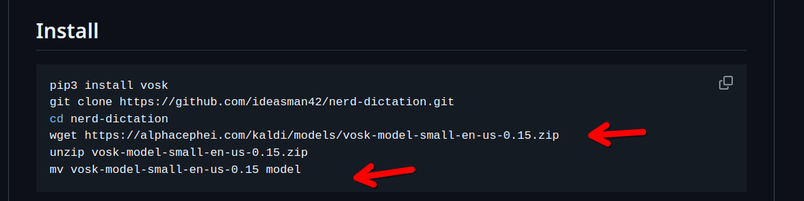
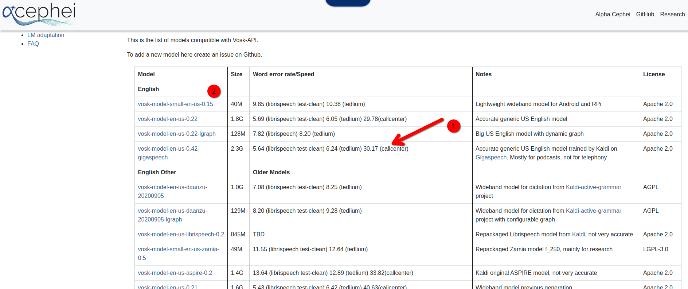
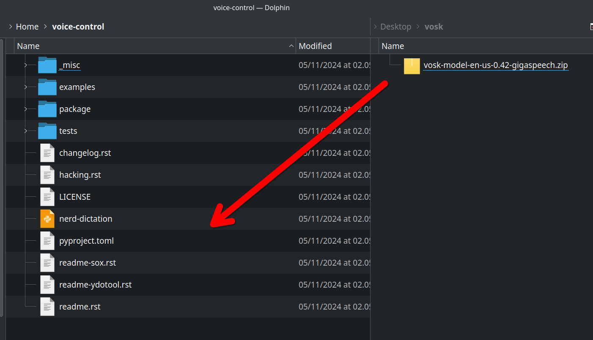
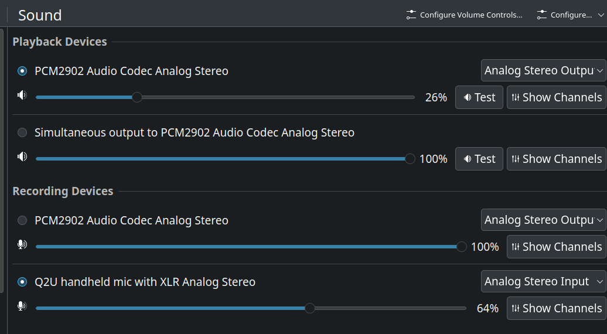
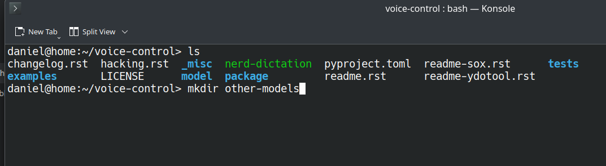
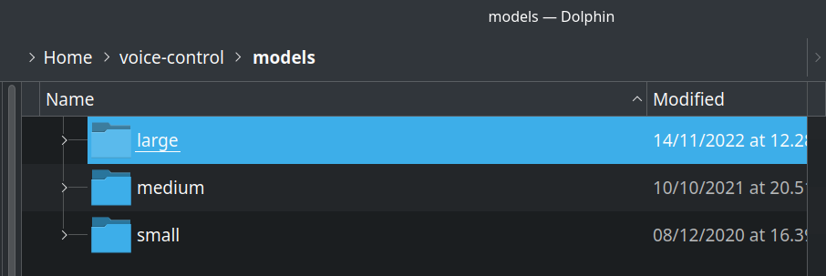
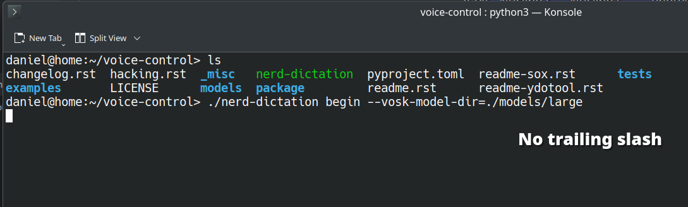
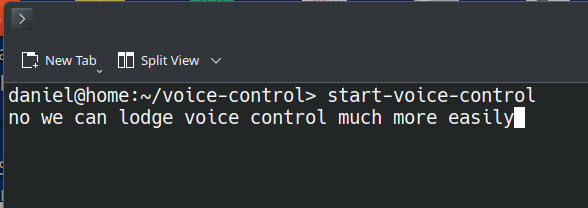
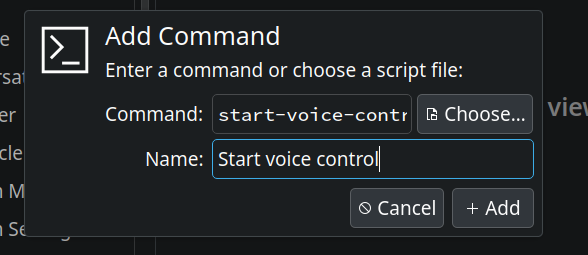

## Nerd Dictation on OpenSUSE, My Installation Tweaks

*Date: 19-Nov-2024*

Nerd Dictation is a great voice control utility for Linux distros (one of too few)!

Follow the instructions as set out on the repo homepage [here](https://github.com/ideasman42/nerd-dictation),

## Download a better VOSK model!

The default install instructions (at the time of writiing) have the user download `vosk-model-small-en-us`.



My suggestion is simply to download the biggest VOSK model instead:

 

 You might also wish to change the installation path a bit so that it's easier to remember.

 I changed mine from `nerd-dictation` to `voice-control`.
 
 

 ## Move VOSK model into folder

 Now you can move the bigger VOSK model into the folder

 

 Then, simply rename the folder `model`.

 ## Enable mic access and verify model is running

This is where I got stuck (my default voice control mic wasn't being recognised).

I needed to install pavucontrol with:

`sudo zypper install pavucontrol`

and then verify that the correct audio device was enabled (and the non-useful one turned off)



## Test and validate

To verify that it's working, you can run the command per the documentation:

`./nerd-dictation begin --vosk-model-dir=./model`

[alt text](itworks.png)

## Switching models

If you decide that you prefer the performance of a different VOSK model, it's easy to just shuffle them into another folder.

I created one called `other-models` in my voice control directory and just moved in the original model:



You can of course populate a few different models in the folder. Just give them easy to remember paths:



Then you can just adjust the model path when running the execution command. Just note not to include a trailing slash:



 # Shortcut configuration

 After finding out which model performs best on your hardware, you can add keyboard shorcuts to start and stop the background dictation process. 

 ## Start background dictation capture

### To start

.`/nerd-dictation begin --vosk-model-dir=./models/small &`

### To stop 

`./nerd-dictation begin --vosk-model-dir=./model &`

# Updating Your Paths For Easy Launching

You can now follow the instructions on the Github repo to move your model 

```
mkdir -p ~/.config/nerd-dictation
mv ./model ~/.config/nerd-dictation
```

## Setting up Bash aliases to start and end voice input

To simplify starting and stopping speech recognition, there are a few approaches that make sense.

One is adding the voice control directory to your path.

Another approach is just creating bash aliases for startingna and stopping voice input.

Let's say I want to set up:

`start-voice-control`

and:

`stop-voice-control`

To start and stop voice recognition (respectively) we can use bash aliases for the start and stop commands:

On my OS (change for your paths):

```bash
~/voice-control/nerd-dictation begin --vosk-model-dir=~/voice-control/models/large
```

And:

```bash
~/voice-control/nerd-dictation end
```

So I added:

```bash
alias start-voice-control='/~/voice-control/nerd-dictation begin --vosk-model-dir=/~/voice-control/models/large &'
```

And

```bash
alias stop-voice-control=' /home/daniel/voice-control/nerd-dictation end'
```

Now we can launch and exit the process much more easily



# Assign keybindings to shortcuts

Now we can assign keybindings much more easily by just mapping them to the Bash alias commands:



